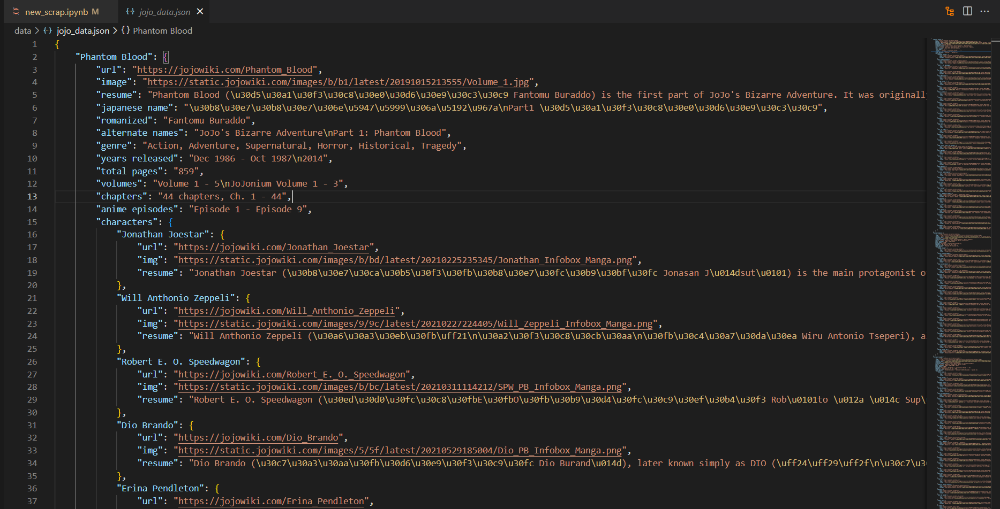

## Web Scraping para extraer información de todos los personajes del Manga <br> *JoJo's Bizarre Adventure (Parte 1-8)*


```python
#Importando Librerías
import time
import pandas as pd
import numpy as np
import matplotlib.pyplot as plt
from selenium import webdriver
from selenium.webdriver.common.by import By
from webdriver_manager.chrome import ChromeDriverManager
import warnings
warnings.filterwarnings("ignore")
# pd.set_option('display.max_rows', None)
```


```python
#Creando WebDriver para la busqueda con Chrome
driver = webdriver.Chrome(ChromeDriverManager().install())

#Ingresando a página para obtener información de las partes de Jojo's
page_url = "https://jojo.fandom.com/es/wiki/Categor%C3%ADa:Partes_de_JoJo%27s_Bizarre_Adventure"
driver.get(page_url)

#Encontrando partes
jojo_parts = driver.find_elements(By.XPATH,'//*[@id="mw-content-text"]/div[3]/div/ul/li/a')

#Extrayendo información Jojo's(Parte - URL)
jojo_titles = []
for parts in jojo_parts:
    
    #Extrayendo nombre de la parte
    title = parts.text
    #Extrayendo link donde se encuentra la tabla con los personajes
    url = parts.get_attribute('href')
    jojo_titles.append({'title':title,'url':url})
    
driver.quit()
```


```python
#Derificando data extraida (Parte - URL)
jojo_titles
```


    [{'title': 'Battle Tendency',
      'url': 'https://jojo.fandom.com/es/wiki/Battle_Tendency'},
     {'title': 'Diamond is Unbreakable',
      'url': 'https://jojo.fandom.com/es/wiki/Diamond_is_Unbreakable'},
     {'title': 'JoJo Lands', 'url': 'https://jojo.fandom.com/es/wiki/JoJo_Lands'},
     {'title': 'JoJolion', 'url': 'https://jojo.fandom.com/es/wiki/JoJolion'},
     {'title': 'Phantom Blood',
      'url': 'https://jojo.fandom.com/es/wiki/Phantom_Blood'},
     {'title': 'Stardust Crusaders',
      'url': 'https://jojo.fandom.com/es/wiki/Stardust_Crusaders'},
     {'title': 'Steel Ball Run',
      'url': 'https://jojo.fandom.com/es/wiki/Steel_Ball_Run'},
     {'title': 'Stone Ocean',
      'url': 'https://jojo.fandom.com/es/wiki/Stone_Ocean'},
     {'title': 'Vento Aureo',
      'url': 'https://jojo.fandom.com/es/wiki/Vento_Aureo'}]


```python
#Lista de Tablas
characters_list = []

for value in jojo_titles:
    #Lectura de tablas con datos de personajes
    df = pd.read_html(value['url'])
    # print(df)
    for i in range(len(df)):
        if df[i].columns[0] in ['Personaje', 'Personajes','Nombre']:
            #Agregando columna para identificar parte
            temp = df[i].copy()
            temp.insert(0,'Parte',value['title'])
            
            #Agregando tabla a la lista
            characters_list.append(temp)
            
#Uniendo tablas de diferentes partes para próxima limpieza
characters = pd.concat(characters_list).reset_index(drop=True)
```


```python
characters
```

</style>
<table border="1" class="dataframe">
  <thead>
    <tr style="text-align: right;">
      <th></th>
      <th>Parte</th>
      <th>Personaje</th>
      <th>Relación</th>
      <th>Nombre</th>
      <th>Stand</th>
      <th>Rol</th>
      <th>Personajes</th>
    </tr>
  </thead>
  <tbody>
    <tr>
      <th>0</th>
      <td>Battle Tendency</td>
      <td>Joseph Joestar</td>
      <td>protagonista</td>
      <td>NaN</td>
      <td>NaN</td>
      <td>NaN</td>
      <td>NaN</td>
    </tr>
    <tr>
      <th>1</th>
      <td>Battle Tendency</td>
      <td>Smokey Brown</td>
      <td>aliado</td>
      <td>NaN</td>
      <td>NaN</td>
      <td>NaN</td>
      <td>NaN</td>
    </tr>
    <tr>
      <th>2</th>
      <td>Battle Tendency</td>
      <td>Erina Joestar</td>
      <td>aliado</td>
      <td>NaN</td>
      <td>NaN</td>
      <td>NaN</td>
      <td>NaN</td>
    </tr>
    <tr>
      <th>3</th>
      <td>Battle Tendency</td>
      <td>Robert Edward O. Speedwagon</td>
      <td>aliado</td>
      <td>NaN</td>
      <td>NaN</td>
      <td>NaN</td>
      <td>NaN</td>
    </tr>
    <tr>
      <th>4</th>
      <td>Battle Tendency</td>
      <td>Rudol von Stroheim</td>
      <td>aliado (antes antagonista)</td>
      <td>NaN</td>
      <td>NaN</td>
      <td>NaN</td>
      <td>NaN</td>
    </tr>
    <tr>
      <th>...</th>
      <td>...</td>
      <td>...</td>
      <td>...</td>
      <td>...</td>
      <td>...</td>
      <td>...</td>
      <td>...</td>
    </tr>
    <tr>
      <th>225</th>
      <td>Vento Aureo</td>
      <td>Cioccolata</td>
      <td>NaN</td>
      <td>NaN</td>
      <td>Green Day</td>
      <td>Antagonista</td>
      <td>NaN</td>
    </tr>
    <tr>
      <th>226</th>
      <td>Vento Aureo</td>
      <td>Secco</td>
      <td>NaN</td>
      <td>NaN</td>
      <td>Oasis</td>
      <td>Antagonista</td>
      <td>NaN</td>
    </tr>
    <tr>
      <th>227</th>
      <td>Vento Aureo</td>
      <td>Scolippi</td>
      <td>NaN</td>
      <td>NaN</td>
      <td>Rolling Stones</td>
      <td>Neutral</td>
      <td>NaN</td>
    </tr>
    <tr>
      <th>228</th>
      <td>Vento Aureo</td>
      <td>Jean Pierre Polnareff</td>
      <td>NaN</td>
      <td>NaN</td>
      <td>Silver Chariot - Chariot Requiem</td>
      <td>Aliado</td>
      <td>NaN</td>
    </tr>
    <tr>
      <th>229</th>
      <td>Vento Aureo</td>
      <td>Diavolo/Vinegar Doppio</td>
      <td>NaN</td>
      <td>NaN</td>
      <td>King Crimson/Epitaph</td>
      <td>Antagonista principal</td>
      <td>NaN</td>
    </tr>
  </tbody>
</table>
<p>230 rows × 7 columns</p>
</div>


```python
#Limpieza de datos por que las columnas tienen nombres diferentes
characters['Relación'] = characters['Relación'].fillna('') + ('' + characters['Rol']).fillna('')
characters['Personaje'] = characters['Personaje'].fillna('') + ('' + characters['Personajes']).fillna('')
characters['Personaje'] = characters['Personaje'].fillna('') + ('' + characters['Nombre']).fillna('')

#Eliminando columnas ya innecesarias
characters.drop(columns=['Rol'], inplace=True)
characters.drop(columns=['Personajes'], inplace=True)
characters.drop(columns=['Nombre'], inplace=True)
# characters.replace({np.nan:''}, inplace=True)
```


```python
characters
```

</style>
<table border="1" class="dataframe">
  <thead>
    <tr style="text-align: right;">
      <th></th>
      <th>Parte</th>
      <th>Personaje</th>
      <th>Relación</th>
      <th>Stand</th>
    </tr>
  </thead>
  <tbody>
    <tr>
      <th>0</th>
      <td>Battle Tendency</td>
      <td>Joseph Joestar</td>
      <td>protagonista</td>
      <td>NaN</td>
    </tr>
    <tr>
      <th>1</th>
      <td>Battle Tendency</td>
      <td>Smokey Brown</td>
      <td>aliado</td>
      <td>NaN</td>
    </tr>
    <tr>
      <th>2</th>
      <td>Battle Tendency</td>
      <td>Erina Joestar</td>
      <td>aliado</td>
      <td>NaN</td>
    </tr>
    <tr>
      <th>3</th>
      <td>Battle Tendency</td>
      <td>Robert Edward O. Speedwagon</td>
      <td>aliado</td>
      <td>NaN</td>
    </tr>
    <tr>
      <th>4</th>
      <td>Battle Tendency</td>
      <td>Rudol von Stroheim</td>
      <td>aliado (antes antagonista)</td>
      <td>NaN</td>
    </tr>
    <tr>
      <th>...</th>
      <td>...</td>
      <td>...</td>
      <td>...</td>
      <td>...</td>
    </tr>
    <tr>
      <th>225</th>
      <td>Vento Aureo</td>
      <td>Cioccolata</td>
      <td>Antagonista</td>
      <td>Green Day</td>
    </tr>
    <tr>
      <th>226</th>
      <td>Vento Aureo</td>
      <td>Secco</td>
      <td>Antagonista</td>
      <td>Oasis</td>
    </tr>
    <tr>
      <th>227</th>
      <td>Vento Aureo</td>
      <td>Scolippi</td>
      <td>Neutral</td>
      <td>Rolling Stones</td>
    </tr>
    <tr>
      <th>228</th>
      <td>Vento Aureo</td>
      <td>Jean Pierre Polnareff</td>
      <td>Aliado</td>
      <td>Silver Chariot - Chariot Requiem</td>
    </tr>
    <tr>
      <th>229</th>
      <td>Vento Aureo</td>
      <td>Diavolo/Vinegar Doppio</td>
      <td>Antagonista principal</td>
      <td>King Crimson/Epitaph</td>
    </tr>
  </tbody>
</table>
<p>230 rows × 4 columns</p>
</div>


```python
#Dando formato Title a todo el Dataframe
characters[characters.columns] = characters[characters.columns].apply(
    lambda x: x.str.title() if x.dtype == "object" else x)

#Corrigiendo registro
characters['Personaje'][characters['Stand']=='Anubis'] = 'Caravan Serai, Chaka, Khan, Jean Pierre Polnareff'
```


```python
characters
```

</style>
<table border="1" class="dataframe">
  <thead>
    <tr style="text-align: right;">
      <th></th>
      <th>Parte</th>
      <th>Personaje</th>
      <th>Relación</th>
      <th>Stand</th>
    </tr>
  </thead>
  <tbody>
    <tr>
      <th>0</th>
      <td>Battle Tendency</td>
      <td>Joseph Joestar</td>
      <td>Protagonista</td>
      <td>NaN</td>
    </tr>
    <tr>
      <th>1</th>
      <td>Battle Tendency</td>
      <td>Smokey Brown</td>
      <td>Aliado</td>
      <td>NaN</td>
    </tr>
    <tr>
      <th>2</th>
      <td>Battle Tendency</td>
      <td>Erina Joestar</td>
      <td>Aliado</td>
      <td>NaN</td>
    </tr>
    <tr>
      <th>3</th>
      <td>Battle Tendency</td>
      <td>Robert Edward O. Speedwagon</td>
      <td>Aliado</td>
      <td>NaN</td>
    </tr>
    <tr>
      <th>4</th>
      <td>Battle Tendency</td>
      <td>Rudol Von Stroheim</td>
      <td>Aliado (Antes Antagonista)</td>
      <td>NaN</td>
    </tr>
    <tr>
      <th>...</th>
      <td>...</td>
      <td>...</td>
      <td>...</td>
      <td>...</td>
    </tr>
    <tr>
      <th>225</th>
      <td>Vento Aureo</td>
      <td>Cioccolata</td>
      <td>Antagonista</td>
      <td>Green Day</td>
    </tr>
    <tr>
      <th>226</th>
      <td>Vento Aureo</td>
      <td>Secco</td>
      <td>Antagonista</td>
      <td>Oasis</td>
    </tr>
    <tr>
      <th>227</th>
      <td>Vento Aureo</td>
      <td>Scolippi</td>
      <td>Neutral</td>
      <td>Rolling Stones</td>
    </tr>
    <tr>
      <th>228</th>
      <td>Vento Aureo</td>
      <td>Jean Pierre Polnareff</td>
      <td>Aliado</td>
      <td>Silver Chariot - Chariot Requiem</td>
    </tr>
    <tr>
      <th>229</th>
      <td>Vento Aureo</td>
      <td>Diavolo/Vinegar Doppio</td>
      <td>Antagonista Principal</td>
      <td>King Crimson/Epitaph</td>
    </tr>
  </tbody>
</table>
<p>230 rows × 4 columns</p>
</div>


```python
characters.Parte.unique()
```


    array(['Battle Tendency', 'Diamond Is Unbreakable', 'Jojolion',
           'Phantom Blood', 'Stardust Crusaders', 'Steel Ball Run',
           'Stone Ocean', 'Vento Aureo'], dtype=object)


```python
parts = ['Phantom Blood', 'Battle Tendency', 'Stardust Crusaders',
             'Diamond Is Unbreakable', 'Vento Aureo', 'Stone Ocean', 'Steel Ball Run', 'Jojolion']
```


```python
characters = characters.set_index('Parte')
characters = characters.loc[parts].reset_index(drop=True)
characters
```


</style>
<table border="1" class="dataframe">
  <thead>
    <tr style="text-align: right;">
      <th></th>
      <th>Personaje</th>
      <th>Relación</th>
      <th>Stand</th>
    </tr>
  </thead>
  <tbody>
    <tr>
      <th>0</th>
      <td>Jonathan Joestar</td>
      <td>Protagonista</td>
      <td>NaN</td>
    </tr>
    <tr>
      <th>1</th>
      <td>George Joestar</td>
      <td>Aliado</td>
      <td>NaN</td>
    </tr>
    <tr>
      <th>2</th>
      <td>Danny</td>
      <td>Aliado</td>
      <td>NaN</td>
    </tr>
    <tr>
      <th>3</th>
      <td>Erina Pendleton</td>
      <td>Aliado</td>
      <td>NaN</td>
    </tr>
    <tr>
      <th>4</th>
      <td>Robert E. O. Speedwagon</td>
      <td>Aliado (Introducido Como Antagonista)</td>
      <td>NaN</td>
    </tr>
    <tr>
      <th>...</th>
      <td>...</td>
      <td>...</td>
      <td>...</td>
    </tr>
    <tr>
      <th>225</th>
      <td>Urban Guerrilla</td>
      <td>Antagonista</td>
      <td>Brain Storm</td>
    </tr>
    <tr>
      <th>226</th>
      <td>Poor Tom</td>
      <td>Antagonista</td>
      <td>Ozone Baby</td>
    </tr>
    <tr>
      <th>227</th>
      <td>Wu Tomoki</td>
      <td>Antagonista</td>
      <td>Doctor Wu</td>
    </tr>
    <tr>
      <th>228</th>
      <td>Satoru Akefu</td>
      <td>Antagonista</td>
      <td>Wonder Of U (Él Mismo)</td>
    </tr>
    <tr>
      <th>229</th>
      <td>Tooru</td>
      <td>Antagonista Principal</td>
      <td>Wonder Of U</td>
    </tr>
  </tbody>
</table>
<p>230 rows × 3 columns</p>
</div>


```python
characters.sort_values('Personaje')
```

</style>
<table border="1" class="dataframe">
  <thead>
    <tr style="text-align: right;">
      <th></th>
      <th>Personaje</th>
      <th>Relación</th>
      <th>Stand</th>
    </tr>
  </thead>
  <tbody>
    <tr>
      <th>216</th>
      <td>Aisho Dainenjiyama</td>
      <td>Antagonista</td>
      <td>Doobie Wah!</td>
    </tr>
    <tr>
      <th>102</th>
      <td>Akira Otoishi</td>
      <td>Antagonista</td>
      <td>Red Hot Chili Pepper</td>
    </tr>
    <tr>
      <th>65</th>
      <td>Alessi</td>
      <td>Antagonista</td>
      <td>Sethan</td>
    </tr>
    <tr>
      <th>173</th>
      <td>Andre Boom Boom</td>
      <td>Antagonista</td>
      <td>Tomb Of The Boom</td>
    </tr>
    <tr>
      <th>101</th>
      <td>Anjuro Katagiri</td>
      <td>Antagonista</td>
      <td>Aqua Necklace</td>
    </tr>
    <tr>
      <th>...</th>
      <td>...</td>
      <td>...</td>
      <td>...</td>
    </tr>
    <tr>
      <th>215</th>
      <td>Yotsuyu Yagiyama</td>
      <td>Antagonista</td>
      <td>I Am A Rock</td>
    </tr>
    <tr>
      <th>84</th>
      <td>Yukako Yamagishi</td>
      <td>Aliado (Antes Antagonista)</td>
      <td>Love Deluxe</td>
    </tr>
    <tr>
      <th>90</th>
      <td>Yuya Fungami</td>
      <td>Neutral (Antes Antagonista)</td>
      <td>Highway Star</td>
    </tr>
    <tr>
      <th>53</th>
      <td>Zz</td>
      <td>Antagonista</td>
      <td>Wheel Of Fortune</td>
    </tr>
    <tr>
      <th>187</th>
      <td>Árbol Gigante</td>
      <td>Neutral</td>
      <td>Sugar Mountain'S Spring</td>
    </tr>
  </tbody>
</table>
<p>230 rows × 3 columns</p>
</div>


```python
characters[characters['Personaje'].str.contains('Jotaro')]
```

</style>
<table border="1" class="dataframe">
  <thead>
    <tr style="text-align: right;">
      <th></th>
      <th>Personaje</th>
      <th>Relación</th>
      <th>Stand</th>
    </tr>
  </thead>
  <tbody>
    <tr>
      <th>35</th>
      <td>Jotaro Kujo</td>
      <td>Protagonista Principal</td>
      <td>Star Platinum</td>
    </tr>
    <tr>
      <th>78</th>
      <td>Jotaro Kujo</td>
      <td>Aliado</td>
      <td>Star Platinum</td>
    </tr>
    <tr>
      <th>115</th>
      <td>Jotaro Kujo</td>
      <td>Aliado (De Koichi)</td>
      <td>Star Platinum (No Visto)</td>
    </tr>
    <tr>
      <th>141</th>
      <td>Jotaro Kujo</td>
      <td>Aliado</td>
      <td>Star Platinum</td>
    </tr>
  </tbody>
</table>
</div>


```python
#Creando CSV con la data obtenida
characters.to_csv('jojo_characters.csv', index=False, encoding='utf-8-sig')
```


```python
#Creando Excel con la data obtenida
characters.to_excel('jojo_characters.xlsx', index=False, encoding='utf-8-sig')
```


```python

```
# New Scraping -> new_scrap.ipynb

